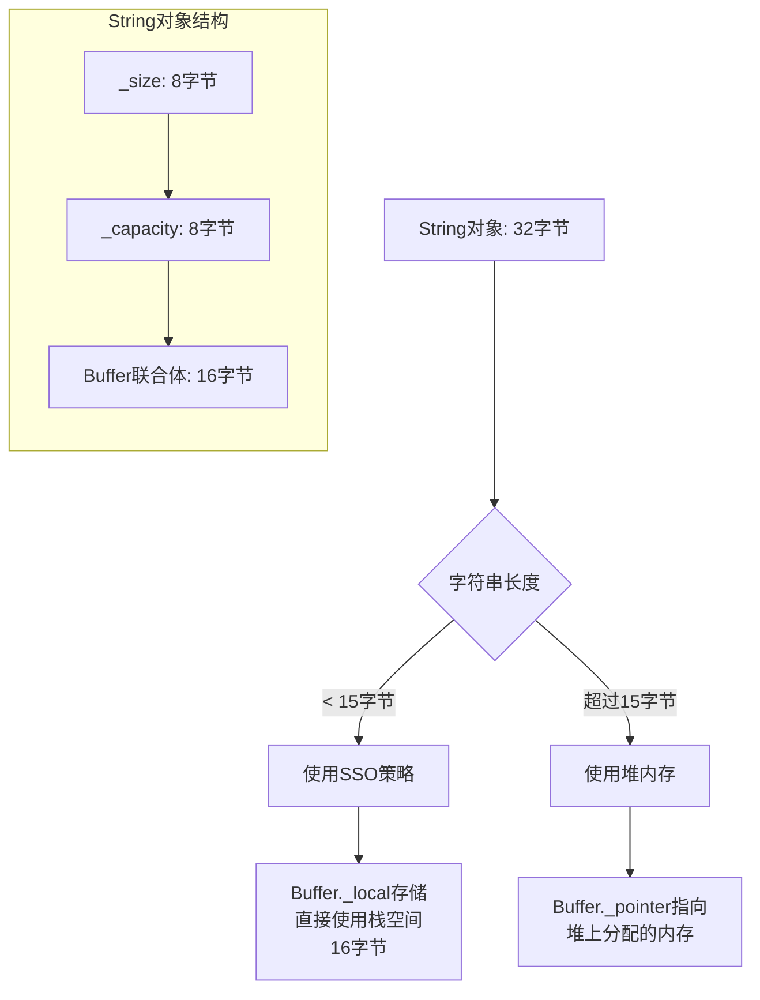

## string的存储结构

```cpp
class string {
 	union Buffer{
 		char * _pointer;
 		char _local[16];
 	};
    
 	size_t _size;
 	size_t _capacity;
	Buffer _buffer;
};
```

string对象共占32个字节，buffer 占 16个字节，size和capacity共占用16个字节

## 验证

可以通过如下程序进行验证：

```cpp
#include <iostream>
#include <string>

using namespace std;

void test0(){
    string str1 = "hello,world!!!!";
    string str2 = "hello,world!!!!!";
    cout << &str1 << endl;
    printf("%p\n", &str1[0]);
    cout << &str2 << endl;
    printf("%p\n", &str2[0]);

}

int main()
{
    test0();
    return 0;
}
```

```bash
[looechao@fedora cpp12]$ ./a.out 
0x7ffcdfdd77d0
0x7ffcdfdd77e0
0x7ffcdfdd77b0
0xbe2f2b0
```

可以发现SSO的策略如下：





- 针对16个字节以内的字符串，直接使用栈上的空间存储buffer
- 针对16个字节以上的字符串，将buffer存在堆区


